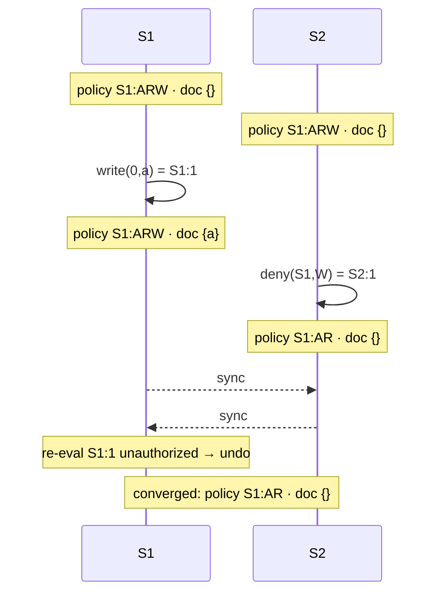
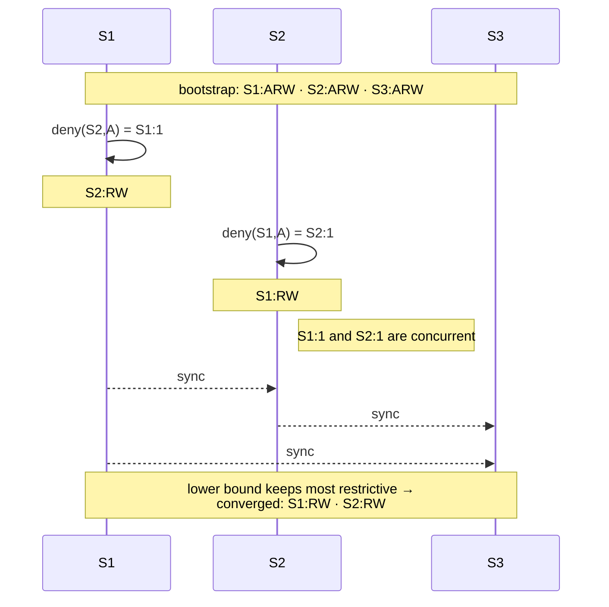
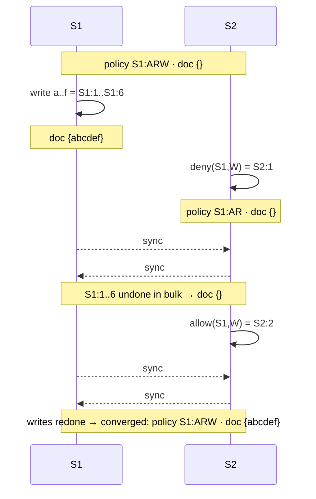
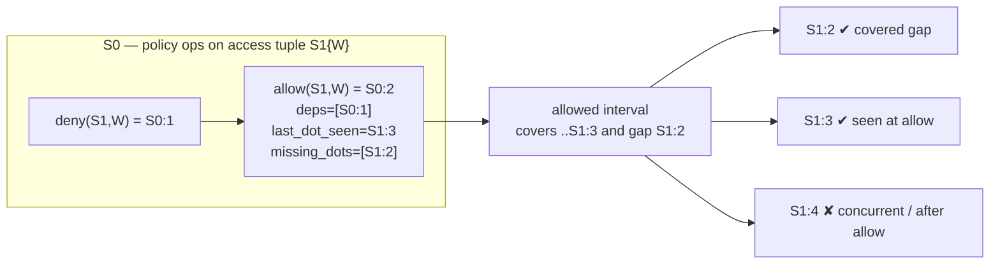
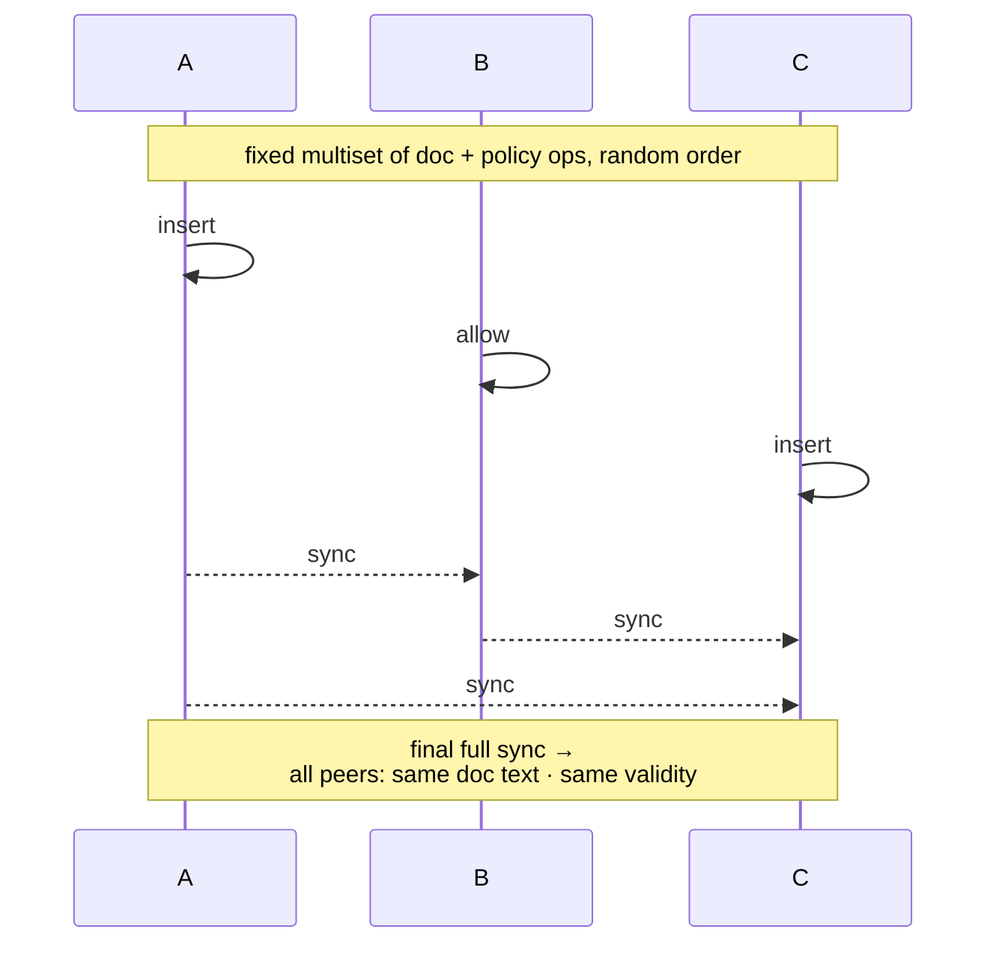

crdt-accure

This project is a toy proof-of-concept implementation for the purposes of illustrating and visualizing the results of [Access control based on CRDTs for Collaborative Distributed Applications](https://inria.hal.science/hal-04224855v1/file/paper%20%281%29.pdf).

## Disclaimer
None of the code in this repository is intended for production use. It is entirely intended for illustration and experimentation.  Should you borrow code from this repository and use it into a production use case, do so at your own liabilty and responsibility.


## Implementation
- implements a server binary which
    - stores document and access control policy data structures in memory
    - performs the ACCURE protocol across a TCP/IP network socket to another instance of the server
    - receives text UI commands from client binary
    - changes to data structures drives ACCURE protocol to replicate changes among 2 or more server peers
    - each server binary starts with a unique identifier
- implements a textual UI client binary which
    - connects to an instance of the server
    - allows users to visualize and edit both a document and access control policy on the connected server instance

The overall project:
- uses Rust for server, client, and all other implementation
- uses the `Automerge` crate as part of the implementation of the CRDT data structure and support for the ACCURE protocol between servers
- is intended to demonstrate, perform, and visualize the ACCURE protocol according to the paper
- provides text UI client facilities to visualize and perform document modifications as well as modifications to access control policy
- each server instance visualizes the protocol, algorithms, and data structures as console output to standard out
- provides test suite to validate algorithms, protocol messages, and data structures

### Out-of-scope

This project considers some elements out of scope:
- does not address authentication, authorization, or security defenses for replication peers or protocol traffic
- does not implement for high performance; rather it optimizes for clarity of code and visualization of algorithm and protocol components
- access control system does not address authorization of listeners/replicators; nor addresses joining/leaving a cluster

## Workspace layout

- `accure-core/` — library: ACCURE data types, validity (Algorithms 1 & 2),
  compensation, Automerge bridge, wire framing, and protocol messages.
- `accure-server/` — binary: hosts an Automerge document, replicates with
  peer servers over TCP using Automerge sync, exposes a client port, and
  prints protocol activity to stdout via `tracing`.
- `accure-client/` — binary: `ratatui` TUI showing live Document, Policy,
  Protocol Log, and Status panes, with a command input line.

## Build

```
cargo build --workspace
```

## Run a two-server demo

In three terminals:

```
# Terminal 1 — server S1
cargo run -p accure-server -- \
    --id S1 \
    --listen 127.0.0.1:7000 --client 127.0.0.1:7100 \
    --peer 127.0.0.1:7001

# Terminal 2 — server S2
cargo run -p accure-server -- \
    --id S2 \
    --listen 127.0.0.1:7001 --client 127.0.0.1:7101 \
    --peer 127.0.0.1:7000

# Terminal 3 — TUI client against S1
cargo run -p accure-client -- --server 127.0.0.1:7100
```

Each server logs ACCURE protocol activity (sync byte counts, op
generation, validity changes, compensation events) to stdout. Connect a
second client to `127.0.0.1:7101` to observe convergence live.

### Client commands

| command                | effect                                              |
|------------------------|-----------------------------------------------------|
| `insert <pos> <char>`  | insert a character at position                      |
| `delete <pos>` / `x`   | delete a character at position                      |
| `allow <site> <r>`     | toggle right `r` (`a`/`r`/`w`) for `<site>` to allow |
| `deny <site> <r>`      | toggle the right to deny                            |
| `snapshot` / `s`       | request a state snapshot                            |
| `quit` / `q` / Esc     | exit the client                                     |

Because policy ops toggle, `allow`/`deny` map to the appropriate
`Effect::Allow` / `Effect::Deny` op given the current state on the
connected server.

## Conflict-resolution strategy

The paper describes both an upper-bound (integrity-favoring) and a
lower-bound (accessibility-favoring) interval merging strategy. Choose
per server with `--strategy`:

```
cargo run -p accure-server -- --id S1 ... --strategy accessibility
```

The default is `integrity`.

## Tests

```
cargo test --workspace
```

This runs:
- DAG unit tests (`accure-core`).
- Paper-figure scenarios (`accure-core/tests/paper_figures.rs`): Fig. 1
  policy convergence, Fig. 2 compensation after concurrent deny, and
  toggling / dependency tests.
- Property-based convergence (`accure-core/tests/convergence_proptest.rs`):
  random interleavings of document + policy ops across three in-memory
  peers must produce identical final state on every site after sync.
- Two-server integration (`accure-server/tests/two_server_convergence.rs`):
  spawns two real `accure-server` processes communicating over loopback
  TCP and drives them through the binary client wire protocol.

### Conflict-resolution scenarios

The cases below exercise conflict resolution — how concurrent, conflicting
operations are merged so that every site converges. Each Mermaid diagram
follows the spacetime style of the paper's figures: one participant per site
with time flowing top to bottom, `Sx:n` denoting the `n`-th operation
generated by site `x`, and notes showing the resulting `policy` / `doc`
state after each step. Bootstrap gives every site `A,R,W` on itself.

> [!NOTE]
> The diagrams below use [Mermaid](https://mermaid.js.org/), which GitHub
> renders automatically in Markdown.

**`fig2_compensation_after_concurrent_deny`** — a concurrent document write
and policy deny converge by compensating the now-unauthorized write (Fig. 2):



**`fig1_policy_convergence_integrity`** — concurrent policy edits by two
administrators are merged with the integrity (lower-bound) strategy so the
divergence shown in the paper resolves to one agreed policy (Fig. 1):



**`concurrent_batch_triggers_bulk_undo_redo`** — a deny concurrent with a
batch of writes triggers a bulk undo; a later allow redoes the whole batch:



**`missing_dots_allow_can_cover_gap`** — a deny then allow on the same access
tuple `S1{W}` defines a validity interval; document ops are accepted or
rejected by where they fall relative to it (validity intervals, Fig. 5):



**`random_interleavings_converge`** (property-based) — a fixed multiset of
document and policy ops is applied across three peers in random order, with
`Sync` steps interleaved arbitrarily; after a final full sync every site must
hold identical document text and validity maps:



## Bootstrap policy

Each server boots with the universal initial policy "every site has
`Admin`, `Read`, and `Write` rights on itself". From there, any
administrator can toggle access for any site via `allow` / `deny`.
