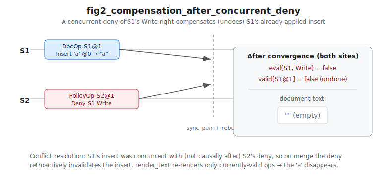
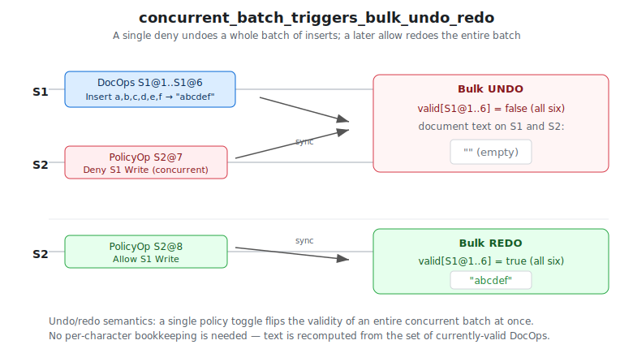
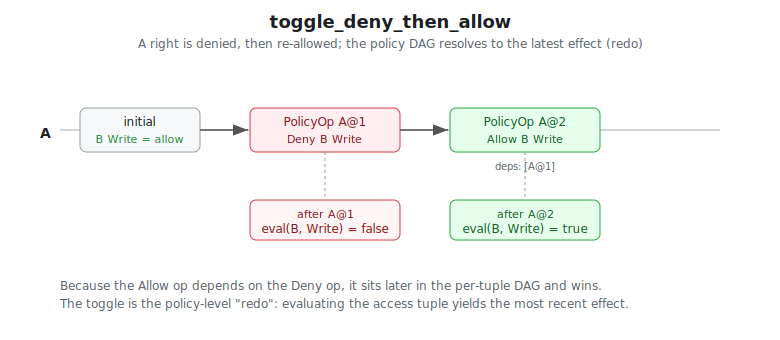
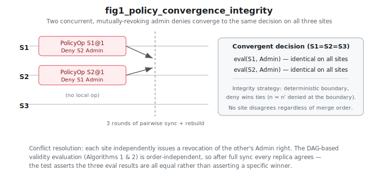
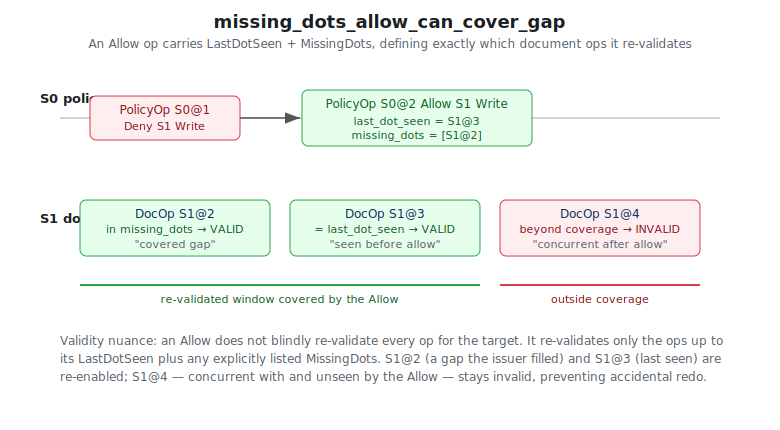
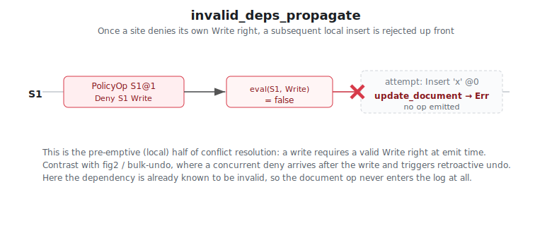
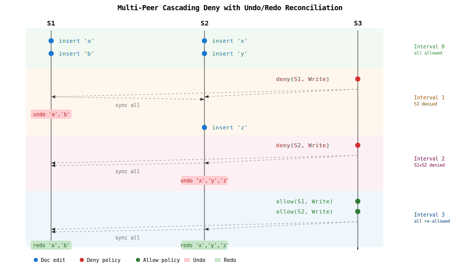

# Illustrative Rust implmentation of ACCURE protocol (crdt-accure)

This project is a toy proof-of-concept implementation for the purposes of illustrating and visualizing the results of [Access control based on CRDTs for Collaborative Distributed Applications](https://inria.hal.science/hal-04224855v1/file/paper%20%281%29.pdf) by Pierre-Antoine Rault, Claudia-Lavinia Ignat, Olivier Perrin.

## Disclaimer
None of the code in this repository is intended for production use. It is entirely intended for illustration and experimentation.  Should you borrow code from this repository and use it into a production use case, do so at your own liabilty and responsibility.


## Implementation
- implements a server binary which
    - stores document and access control policy data structures in memory
    - performs the ACCURE protocol across a TCP/IP network socket to another instance of the server
    - receives text UI commands from client binary
    - changes to data structures drives ACCURE protocol to replicate changes among 2 or more server peers
    - each server binary starts with a unique identifier
- implements a textual UI client binary which
    - connects to an instance of the server
    - allows users to visualize and edit both a document and access control policy on the connected server instance

The overall project:
- uses Rust for server, client, and all other implementation
- uses the `Automerge` crate as part of the implementation of the CRDT data structure and support for the ACCURE protocol between servers
- is intended to demonstrate, perform, and visualize the ACCURE protocol according to the paper
- provides text UI client facilities to visualize and perform document modifications as well as modifications to access control policy
- each server instance visualizes the protocol, algorithms, and data structures as console output to standard out
- provides test suite to validate algorithms, protocol messages, and data structures

### Out-of-scope

This project considers some elements out of scope:
- does not address authentication, authorization, or security defenses for replication peers or protocol traffic
- does not implement for high performance; rather it optimizes for clarity of code and visualization of algorithm and protocol components
- access control system does not address authorization of listeners/replicators; nor addresses joining/leaving a cluster

## Workspace layout

- `accure-core/` — library: ACCURE data types, validity (Algorithms 1 & 2),
  compensation, Automerge bridge, wire framing, and protocol messages.
- `accure-server/` — binary: hosts an Automerge document, replicates with
  peer servers over TCP using Automerge sync, exposes a client port, and
  prints protocol activity to stdout via `tracing`.
- `accure-client/` — binary: `ratatui` TUI showing live Document, Policy,
  Protocol Log, and Status panes, with a command input line.

## Build

```
cargo build --workspace
```

## Run a two-server demo

In three terminals:

```
# Terminal 1 — server S1
cargo run -p accure-server -- \
    --id S1 \
    --listen 127.0.0.1:7000 --client 127.0.0.1:7100 \
    --peer 127.0.0.1:7001

# Terminal 2 — server S2
cargo run -p accure-server -- \
    --id S2 \
    --listen 127.0.0.1:7001 --client 127.0.0.1:7101 \
    --peer 127.0.0.1:7000

# Terminal 3 — TUI client against S1
cargo run -p accure-client -- --server 127.0.0.1:7100
```

Each server logs ACCURE protocol activity (sync byte counts, op
generation, validity changes, compensation events) to stdout. Connect a
second client to `127.0.0.1:7101` to observe convergence live.

### Client commands

| command                | effect                                              |
|------------------------|-----------------------------------------------------|
| `insert <pos> <char>`  | insert a character at position                      |
| `delete <pos>` / `x`   | delete a character at position                      |
| `allow <site> <r>`     | toggle right `r` (`a`/`r`/`w`) for `<site>` to allow |
| `deny <site> <r>`      | toggle the right to deny                            |
| `snapshot` / `s`       | request a state snapshot                            |
| `quit` / `q` / Esc     | exit the client                                     |

Because policy ops toggle, `allow`/`deny` map to the appropriate
`Effect::Allow` / `Effect::Deny` op given the current state on the
connected server.

## Conflict-resolution strategy

The paper describes both an upper-bound (integrity-favoring) and a
lower-bound (accessibility-favoring) interval merging strategy. Choose
per server with `--strategy`:

```
cargo run -p accure-server -- --id S1 ... --strategy accessibility
```

The default is `integrity`.

## Tests

```
cargo test --workspace
```

This runs:
- DAG unit tests (`accure-core`).
- Paper-figure scenarios (`accure-core/tests/paper_figures.rs`): Fig. 1
  policy convergence, Fig. 2 compensation after concurrent deny,
  toggling / dependency tests, and multi-peer cascading deny with
  undo/redo reconciliation.
- Property-based convergence (`accure-core/tests/convergence_proptest.rs`):
  random interleavings of document + policy ops across three in-memory
  peers must produce identical final state on every site after sync.
- Two-server integration (`accure-server/tests/two_server_convergence.rs`):
  spawns two real `accure-server` processes communicating over loopback
  TCP and drives them through the binary client wire protocol.

## Conflict-resolution & undo/redo test cases

The diagrams below visualize the `accure-core/tests/paper_figures.rs`
scenarios that exercise conflict resolution and undo/redo semantics. Each
diagram traces the operations emitted on every site, the sync/rebuild step,
and the resulting document text and validity state — mirroring exactly what
the corresponding `#[test]` asserts.

### `fig2_compensation_after_concurrent_deny`

S1 inserts a character while, concurrently, S2 denies S1's `Write` right.
After sync the deny retroactively invalidates the insert (compensation /
undo), so both sites converge on empty text.



### `concurrent_batch_triggers_bulk_undo_redo`

A six-character insert batch on S1 races a single `Deny S1 Write` on S2.
The deny undoes the whole batch at once; a later `Allow S1 Write` redoes
the entire batch. Text is recomputed from the set of currently-valid
`DocOp`s, so no per-character undo bookkeeping is required.



### `toggle_deny_then_allow`

Denying then re-allowing a right on a single site shows the policy-level
redo: the `Allow` op depends on the `Deny`, sits later in the per-tuple
DAG, and therefore wins when the access tuple is evaluated.



### `fig1_policy_convergence_integrity`

S1 and S2 concurrently revoke each other's `Admin` right across three
peers. The DAG-based validity evaluation is order-independent, so after
full sync all three sites agree on the same decision (the test asserts
agreement rather than a specific winner).



### `missing_dots_allow_can_cover_gap`

An `Allow` op carries `LastDotSeen` and `MissingDots`, which precisely
bound the document ops it re-validates. Ops within that window are redone;
a concurrent op the `Allow` never saw stays invalid — preventing an
accidental redo.



### `invalid_deps_propagate`

The pre-emptive half of conflict resolution: once a site denies its own
`Write` right, a subsequent local insert is rejected at emit time and never
enters the log at all.



### Multi-peer cascading deny scenario

The `multi_peer_cascading_deny_undo_redo` test exercises a non-trivial
conflict requiring undo/redo reconciliation on **two** peers across
multiple policy intervals:



| Interval | Action | Effect |
|----------|--------|--------|
| 0 | S1 inserts 'a','b'; S2 inserts 'x','y' (concurrent) | All edits valid |
| 1 | S3 → deny(S1, Write); sync all | S1's edits undone; S2 inserts 'z' |
| 2 | S3 → deny(S2, Write); sync all | S2's edits undone; document empty |
| 3 | S3 → allow(S1, Write) + allow(S2, Write); sync all | Both peers' edits redone |

All three peers converge to identical state after each interval.

## Bootstrap policy

Each server boots with the universal initial policy "every site has
`Admin`, `Read`, and `Write` rights on itself". From there, any
administrator can toggle access for any site via `allow` / `deny`.
